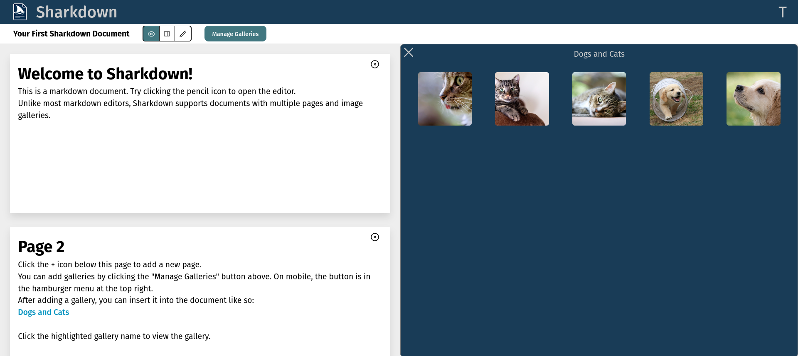

# Sharkdown

Sharkdown is a responsive editor for markdown documents in the cloud.

Sharkdown extends the markdown spec with 2 new features:

1. Multi-page support
2. Image gallery support

This repository contains both the Vue.js frontend and Express.js backend for the application.





## Frontend

To run the frontend, first install the required packages:

```
cd frontend
npm i
```

Run the dev server or build for deployment using the following commands, respectively:

```
npm run dev
npm run build
```

## Backend

To run the backend, first install the required packages and generate the environment file (for the JWT secret):

```
cd backend
echo "JWT_SECRET=$(openssl rand -hex 32)" > .env
npm i
```

Once complete, run the serve script:

```
npm run serve
```

This will run the API server's 'app.ts' file directly via tsx.

## Tests

To run the tests, ensure the frontend and backend dependencies have been installed. Then, in the project's root, run the following commands:

```
npm i
npm run e2e:all
```

This will start the frontend app, start the backend app with an in-memory database, and execute the Cypress tests.
